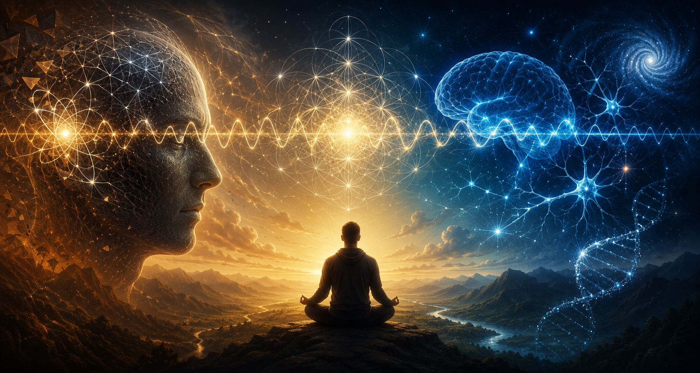

# A Lei da Vibração e o Peso Invisível do Passado

Por que algumas pessoas parecem caminhar em círculos, repetindo os mesmos conflitos, as mesmas frustrações e os mesmos resultados, mesmo quando se esforçam sinceramente para mudar?

Essa é uma pergunta antiga. Muito antes da psicologia moderna, filósofos, sábios e tradições espirituais já se perguntavam por que a transformação humana é tão difícil. Hoje, uma das respostas mais populares para essa questão aparece no conceito conhecido como **"lei da vibração"**.

Embora o termo seja frequentemente associado ao universo da espiritualidade contemporânea, existe uma reflexão filosófica mais profunda por trás dele. Em sua essência, a lei da vibração sugere que a qualidade da nossa experiência não depende apenas das circunstâncias externas, mas principalmente do **estado interno a partir do qual interpretamos e respondemos ao mundo**.

## O passado que continua vivendo dentro de nós

Muitas pessoas acreditam que mudar de vida significa estabelecer novos objetivos, criar novos planos ou tomar novas decisões. No entanto, a experiência humana nos mostra algo diferente.

É possível desejar um futuro novo enquanto se continua emocionalmente preso ao passado.

Alguém pode querer viver um relacionamento saudável, mas ainda carregar o medo do abandono. Pode desejar prosperidade, mas continuar dominado pela sensação de escassez. Pode buscar paz, enquanto permanece internamente em estado de alerta permanente.

Nesse sentido, o verdadeiro obstáculo nem sempre está fora. Muitas vezes, ele está na **permanência de uma identidade antiga que continua operando silenciosamente**.

Carl Gustav Jung observou que boa parte da nossa vida psíquica acontece fora da consciência. Não somos guiados apenas pelas decisões que tomamos deliberadamente, mas também por crenças, memórias emocionais e padrões que se formaram ao longo da existência.

Aquilo que não reconhecemos em nós continua influenciando nossas escolhas.

## A frequência da alma

Quando falamos em "vibração", podemos compreender a palavra como uma metáfora para o estado predominante da consciência.

Não se trata de um pensamento isolado ou de uma emoção passageira. Trata-se da atmosfera interior que habitamos na maior parte do tempo.

Algumas pessoas vivem em uma frequência de medo. Outras, em uma frequência de ressentimento. Algumas habitam a ansiedade; outras, a confiança.

**Essa frequência interior molda nossa forma de perceber a realidade**.

Duas pessoas podem atravessar exatamente a mesma situação e produzir interpretações completamente diferentes. Uma enxerga ameaça. A outra vê oportunidade. Uma se fecha. A outra cresce.

O acontecimento é o mesmo.

O estado interno é diferente.

E é justamente esse estado que influencia decisões, relacionamentos, atitudes e possibilidades.

## O inconsciente e seus programas invisíveis

Freud afirmava que o ego não é senhor em sua própria casa. Grande parte do que fazemos é impulsionada por conteúdos inconscientes.

Jung ampliou essa visão ao mostrar que o inconsciente não é apenas um depósito de lembranças reprimidas. Ele é uma força criativa que organiza símbolos, emoções e comportamentos.

Por essa perspectiva, muitos dos nossos bloqueios não são fruto de falta de vontade.

Eles são **tentativas de proteção**.

Um medo de rejeição pode esconder antigas feridas afetivas. Uma necessidade excessiva de controle pode ser uma resposta a experiências de insegurança. Uma dificuldade em confiar pode nascer de decepções que ocorreram há muito tempo.

O problema é que mecanismos criados para proteger acabam, muitas vezes, **aprisionando**.

**Aquilo que um dia serviu como defesa passa a limitar a vida**.

## A repetição dos padrões

Existe uma frase atribuída a diversos pensadores que resume bem esse fenômeno: _"Aquilo que não é conscientizado retorna como destino."_

Quando não reconhecemos nossos padrões internos, tendemos a reproduzi-los.

A pessoa que teme o abandono pode, sem perceber, escolher relações que confirmem esse medo. Quem acredita não ser digno de amor pode rejeitar oportunidades genuínas de afeto. Quem vive em constante desconfiança frequentemente encontra razões para continuar desconfiando.

Não porque o universo esteja conspirando contra ela.

Mas porque **a percepção humana tende a selecionar e interpretar a realidade de acordo com aquilo que já acredita ser verdadeiro**.

A frequência, nesse contexto, não é uma força mágica. É um hábito psicológico profundamente enraizado.

## O caminho da transformação

Se os padrões foram aprendidos, eles também podem ser transformados.

> Toda mudança autêntica começa pelo reconhecimento.

**Antes de tentar se tornar alguém diferente, é necessário compreender quem você é no presente**.

> Isso exige honestidade.

Qual é o estado emocional que mais frequentemente acompanha seus dias?

Medo?

Raiva?

Tristeza?

Ansiedade?

Ou talvez uma sensação constante de insuficiência?

**Nomear aquilo que sentimos é um ato de coragem**. Muitas vezes passamos anos fugindo exatamente das emoções que precisam ser compreendidas.

Depois do reconhecimento, surge uma segunda tarefa: 

> Investigar a origem.

De onde veio esse padrão?

Ele nasceu de uma experiência pessoal? Foi aprendido na família? Foi absorvido do ambiente?

Nem toda herança é genética. Muitas das nossas crenças são emocionais.

**Aprendemos observando**.

**Aprendemos convivendo**.

**Aprendemos sobrevivendo**.

## O corpo como porta de entrada

Uma das descobertas mais importantes da psicologia contemporânea é que a transformação não acontece apenas por meio de ideias.

O corpo também participa do processo.

Práticas como **meditação, contemplação, respiração consciente, contato com a natureza, arte e atividade física** podem alterar significativamente a forma como experimentamos a vida.

Elas ajudam a criar **novas experiências emocionais**.

E são essas experiências repetidas que gradualmente constroem novos estados internos.

A mudança profunda raramente acontece por convencimento intelectual.

**Ela acontece quando algo novo é vivido**.

## A sabedoria das tradições antigas

Diversas tradições espirituais ensinaram, cada uma à sua maneira, que existe uma conexão profunda entre o indivíduo e o todo.

Os **povos indígenas** frequentemente falam sobre a **interdependência de todas as formas de vida**.

A **filosofia védica** descreve o universo como uma **pulsação contínua de expansão e contração**.

O **estoicismo** ensinava que a verdadeira liberdade surge quando **deixamos de lutar contra a realidade e aprendemos a governar nossa própria mente**.

Apesar das diferenças culturais e históricas, todas essas tradições apontam para uma mesma direção:

> A qualidade da vida depende menos do controle dos acontecimentos e mais da qualidade da consciência que os experimenta.

## A coragem de atualizar quem somos

Talvez o maior ensinamento da chamada lei da vibração seja este:

> Não carregamos apenas memórias do passado. Carregamos versões antigas de nós mesmos.

Muitas dessas versões nasceram para nos **proteger**.

Mas chega um momento em que a proteção se transforma em **prisão**.

A verdadeira transformação começa quando paramos de perguntar apenas _"o que eu quero?"_ e começamos a perguntar _"quem sou eu hoje?"_ e _"quais partes de mim ainda vivem presas ao que já passou?"_.

Mudar a frequência não significa pensar positivo o tempo todo.

> Significa reconhecer com honestidade os estados internos que governam nossa vida.

> Significa trazer luz ao que estava oculto.

> Significa atualizar a identidade para que o passado deixe de escrever o futuro.

E talvez seja justamente aí que começa toda liberdade: **no instante em que percebemos que não somos obrigados a continuar sendo a mesma pessoa que fomos ontem**.
