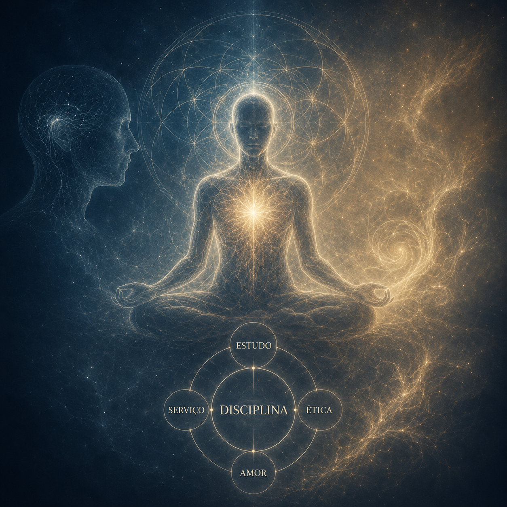

Em muitos círculos espiritualistas é comum ouvir expressões como **"pessoa evoluída", "ascensão espiritual" ou "alto grau de evolução"**. Conceitos, frequentemente mal compreendidos e utilizados de forma superficial.

A **mediunidade** não deve ser vista como um sinal de superioridade moral ou espiritual, mas como uma **faculdade natural do ser humano**, cuja relevância depende da forma como é utilizada.

#### Mediunidade Não é Sinônimo de Evolução

É necessário que exista uma **distinção entre mediunidade e desenvolvimento moral**. A mediunidade está mais relacionada à sensibilidade para perceber dimensões espirituais do que a um suposto grau de elevação pessoal.

Sob essa ótica, a mediunidade possui características orgânicas, envolvendo aspectos fisiológicos e neurológicos do indivíduo. Algumas dessas predisposições seriam **planejadas antes da encarnação**, de acordo com tarefas específicas que a pessoa deverá desempenhar ao longo da vida.

Consequentemente, **possuir mediunidade não torna alguém melhor**, mais sábio ou moralmente superior.

#### Moral ou ética?

Ao analisarmos a moral, observamos que ela muda conforme a época, a cultura e o contexto social

O que é considerado moralmente aceitável hoje, pode não ter sido no passado e pode voltar a mudar no futuro.

Para ilustrar a ideia, vamos utilizar um exemplo simples, a reação das pessoas diante de uma barata e de uma borboleta.

Enquanto esmagar uma barata costuma ser socialmente aceito, fazer o mesmo com uma borboleta gera reprovação. Isso demonstra como nossos julgamentos são influenciados por **preferências e condicionamentos culturais**.

Por isso, é preferível analisar as pessoas sob uma perspectiva ética, relacionada à consciência e à responsabilidade, em vez de uma moral baseada exclusivamente em normas sociais ou religiosas.

#### O Verdadeiro Valor da Mediunidade

A mediunidade é uma capacidade inerente ao ser humano e deve servir tanto ao indivíduo quanto à coletividade.

Nesse sentido, o que realmente diferencia uma pessoa não é o fato de possuir mediunidade, mas **aquilo que ela realiza por meio dela**.

O valor da mediunidade está no **serviço prestado ao próximo**. O fenômeno mediúnico não deveria ser tratado como espetáculo ou instrumento de promoção pessoal.

Ao ampliarmos nosso olhar sobre o tema, podemos afirmar que **a mediunidade pode ser expressa através de atitudes simples do cotidiano**: cuidar dos mais velhos, realizar tarefas domésticas, comunicar-se com respeito ou ajudar alguém em necessidade.

Dessa forma, **o amor e o serviço ao próximo** são manifestações mais importantes da espiritualidade do que fenômenos extraordinários.

#### Mentores Espirituais e a Ocultação da Identidade

Muitos espíritos ocultam deliberadamente seus nomes e aparências para evitar que os médiuns desenvolvam vaidade ou dependência psicológica de figuras de autoridade. Isso acontece porque o **importante não é quem transmite a mensagem, mas o conteúdo transmitido**.

À medida que o médium amadurece emocional e espiritualmente, a identificação dos mentores ocorre de forma mais natural. Ainda assim, é necessário um cuidado especial para os riscos da idealização excessiva dos espíritos.

#### A Interpretação Mediúnica e o Animismo

Existe uma diferença significativa entre aquilo que o espírito transmite e aquilo que o médium compreende e reproduz.

Nesse processo, crenças pessoais, expectativas culturais, imagens mentais e experiências prévias influenciam a forma como a mensagem é percebida.

Esse fenômeno, conhecido em muitos estudos espíritas como **animismo**, faz com que médiuns frequentemente atribuam características exageradas ou fantasiosas aos espíritos comunicantes.

Assim, descrições grandiosas de mentores espirituais poderiam refletir muito mais a imaginação e os referenciais culturais do médium do que a realidade do espírito em questão.

#### A Necessidade do Estudo

No Livro dos Médiuns, capítulo XIX, item 225, os espíritos explicam que **o médium é um instrumento** e a qualidade da comunicação depende da preparação intelectual do instrumento.

A ideia central é que a mediunidade exige **aprimoramento constante**. O conhecimento ajuda o médium a compreender melhor os fenômenos que vivencia, reduzindo erros de interpretação e vulnerabilidades psicológicas.

Sem estudo, o médium corre o risco de se tornar presa fácil para ilusões, autoengano ou influências espirituais inadequadas.

#### Mistificação e Autoengano

Outro alerta importante refere-se à mistificação, quando um médium se recusa a evoluir intelectualmente ou a aperfeiçoar sua prática, espíritos mais sérios tendem a se afastar.

Nesse cenário, outras influências podem ocupar esse espaço, gerando **comunicações distorcidas ou fraudulentas**.

O problema torna-se ainda mais grave quando existe interesse do próprio médium em manter uma aparência de autoridade espiritual, mesmo sem possuir condições reais para isso.

Por essa razão, **humildade, senso crítico e estudo** são apresentados como mecanismos fundamentais de proteção.

#### Disciplina como Fundamento da Prática Mediúnica

A **disciplina** pode ser definida como a capacidade de cumprir aquilo que precisa ser feito, independentemente da vontade momentânea.

Na prática mediúnica, isso significa manter horários, compromissos, estudos e atividades assumidas, mesmo diante do cansaço, das dificuldades ou da falta de motivação.

Não existe trabalho mediúnico sério sem organização mental, equilíbrio emocional e constância de esforços.

A disciplina não é apenas uma virtude desejável, mas um requisito indispensável para a construção de uma atividade espiritual consistente.

---

O objetivo aqui foi mostrar uma **visão pragmática da mediunidade**, afastando-se de interpretações místicas que associam fenômenos mediúnicos à superioridade espiritual.

A mediunidade é uma capacidade humana natural, cuja importância depende do uso que dela se faz. **O verdadeiro crescimento espiritual não está na busca por experiências extraordinárias, mas no desenvolvimento de qualidades como responsabilidade, amor ao próximo, estudo contínuo, humildade e disciplina**.

Sob essa perspectiva, a **espiritualidade** deixa de ser um caminho de exaltação pessoal e passa a ser compreendida como um **compromisso permanente com o autoconhecimento, o serviço e a transformação interior**.